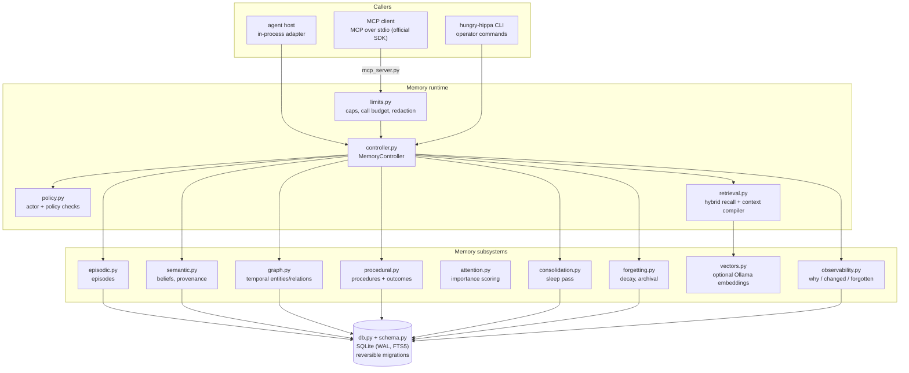

# Hungry Hippa

**One memory. Every AI. You own it.**

Today: local SQLite memory and six stdio MCP tools. Additional client adapters
and the complete historical import-to-recall workflow are still in progress.

Hungry Hippa gives AI a memory you own. It keeps useful memory on your machine and
lets connected AI tools remember it later. The model can change. The provider can
change. The memory layer stays yours.

Your AI can change. Your memory doesn't have to.

Hungry Hippa is **not** an AI model. It is the memory layer *underneath* AI models and
agents — a local database plus the runtime that reads and writes it:

- Different MCP-capable AI clients can use the **same** locally controlled memory.
- **You** own and control the store. The primary memory store is a local SQLite
  database on your machine; Hungry Hippa does not upload that database to a model
  provider.
- Switching models or providers does not inherently require abandoning the memory
  layer, because the memory is not stored inside the model.
- **MCP** (Model Context Protocol) is the interoperability mechanism today. Clients
  that do not speak MCP are out of scope for now, and this README says so rather than
  implying otherwise.

Connected AI clients may transmit recalled context according to their own configuration
and privacy policies.

Not a vector database, not chat-history search, not a bigger `MEMORY.md`.

Simply put: if you have ever lost an agent's hard-won experience because you changed
models, changed tools, or hit a context limit, that is the problem this solves.

## Under the hood

The plain version above is the point; this is how it is built. Hungry Hippa is a
local-first memory runtime: episodic memory, a temporal knowledge graph, semantic
beliefs with provenance, contradiction and supersession handling, a context compiler,
consolidation, reversible forgetting, procedural learning, quarantine for untrusted
writes, and a local MCP server built on the **official MCP Python SDK** — on top of
plain SQLite.

```
PERCEIVE → ATTEND → RECALL → COMPILE CONTEXT → REASON → ACT → OBSERVE
    ↑                                                            ↓
    └──────── CHANGE ← CONSOLIDATE ← FORGET ← LEARN ← REMEMBER ──┘
```

This repository was formerly **Living Cortex**. It is now a standalone local-first
package, `hungry-hippa`, that speaks MCP through the official SDK. An existing database
written by the former release is still found (read-only discovery, so memories are not
stranded); see [docs/MIGRATION.md](docs/MIGRATION.md).

## What it does, and what is tested

| Capability | Implementation | Test |
|---|---|---|
| Episodic memory | Structured episodes (context, actions, tools, decisions, outcome, importance) | `test_acceptance.py` T1 |
| Immutable evidence | sha256-hashed `evidence` rows, insert-only | T7 |
| Temporal graph | Entities + relationships with `valid_from`/`valid_until`; supersession keeps history | T3, T4 |
| Semantic beliefs | Facts/beliefs/hypotheses with `source_class` provenance and confidence | T5, T7 |
| Contradictions | All claims preserved and cross-linked; explicit user correction wins | T5 |
| Hybrid retrieval | FTS5 + graph traversal, ranked by salience × recency × relevance × confidence, decomposable via `explain=True` | T2, T10, `test_memory_architecture.py` |
| Context compiler | `{items, rendering, token_estimate, excluded}` inside an explicit character budget; dedupe; active beats superseded | `test_memory_architecture.py` |
| Quarantine + actor policy | Untrusted writes stored quarantined; excluded from recall, belief listing and consolidation input | `test_memory_architecture.py`, `test_security.py` |
| Consolidation | Deterministic "sleep" pass: dedupe, relationship extraction, contradiction analysis, procedural candidates | T9, T6 |
| Forgetting | Decay, compression, reversible archival; purge is owner-only and confirm-gated over MCP | T8, `test_security.py` |
| Procedural memory | Experience → procedural candidate → validated procedure → skill promotion (needs explicit user approval) | T6, `test_memory_architecture.py` |
| Local MCP server | Six `hippa_*` tools over stdio, official MCP SDK, no network listener | `test_mcp_integration.py` |
| Request limits | Argument, result and frame caps; per-process call budget; database-backed write quota; audit-log redaction | `test_security.py`, `test_resource_limits.py` |
| Identity binding | Identity and provenance resolved from the launch channel; owner token in the server's environment; no secret in any tool schema | `test_trust_boundary.py`, `test_trust_token.py` |

Explicitly **not** implemented, and not claimed: model training, model-weight updates,
consciousness, self-learning, "unhackable", enterprise-ready, multi-tenant isolation,
encryption at rest (use your OS), tamper-evident audit chain. See
[docs/SECURITY.md](docs/SECURITY.md) and [docs/THREAT_MODEL.md](docs/THREAT_MODEL.md).

## Quick start

Requires Python 3.10+ and SQLite. The only third-party dependency is the official MCP
SDK, declared in `pyproject.toml`; no network calls are required at runtime.

**The store is plaintext.** Hungry Hippa keeps memory in a local SQLite database (created
`0600`, under `$XDG_DATA_HOME/hungry-hippa/`) with no application-level encryption. Use
OS or disk encryption if the memories are sensitive: `0600` is a permission, not
encryption, and any process running as you can read the file.

```bash
# 1. Install (a virtualenv is recommended; PEP 668 systems refuse a system install)
python -m venv .venv && . .venv/bin/activate
python -m pip install -e .

# 2. Create the owner token (0600, under $XDG_STATE_HOME/hungry-hippa/)
hungry-hippa owner-token --print      # paste the value into your MCP host config

# 3. Verify
hungry-hippa status                   # database health + counts (no row contents)
```

Point your MCP host at the server, passing the token in the **server's** environment
(see [docs/MCP.md](docs/MCP.md) for host-ready snippets):

```json
{"mcpServers": {"hungry-hippa": {"command": "hungry-hippa-mcp",
                                 "env": {"HUNGRY_HIPPA_OWNER_TOKEN": "…"}}}}
```

Without the token in that environment the instance is untrusted: it can write candidates
and read only its own rows. An in-process host can instead load the bundle and register
the adapter (`hungry_hippa.HungryHippaProvider` via `hungry_hippa.register`), which binds
with owner identity and agent provenance.

No always-on daemon is required. MCP hosts launch Hungry Hippa locally over stdio when
they need it and it exits with them; the CLI is a one-shot command. Consolidation ("the
sleep pass") runs when a host or the CLI triggers it — `hungry-hippa consolidate`, or at
session end for a host that wires the adapter. The `consolidation.cron_schedule` key is
a hint a host may use to schedule that; nothing in this repository runs a scheduler.

Check it works without touching your data:

```bash
python scripts/check_all.py                # every suite + demo check + eval drift check
```

Or run them individually:

```bash
python tests/test_acceptance.py            # 10/10 spec acceptance tests, temp DB
python demo/demo.py --check                # 8-step demo, throwaway DB, verified transcript
python eval/harness.py                     # memory challenge, writes eval/results.json
```

## Architecture



Every module above exists in this repository (see `Layout`). The diagram is a map of
the code, not a plan.

## Install, in detail

Hungry Hippa installs as a package. Nothing is compiled, no service is started and no
background process is left running: an MCP host spawns the stdio server when it needs
it, and an in-process host registers the adapter with one call.

```bash
git clone <this repository> hungry-hippa
python -m pip install -e .
# MCP host: command = hungry-hippa-mcp, with HUNGRY_HIPPA_OWNER_TOKEN in its env
# in-process host: hungry_hippa.register(ctx)  ->  HungryHippaProvider
```

## Configuration

Defaults live in `config.py`. Override them in
`$XDG_CONFIG_HOME/hungry-hippa/config.json`, or set the database path with an
environment variable. The file is plain JSON: a partial file is merged over the
defaults, so you only list what you are changing.

```json
{
  "db_path": "",
  "retrieval": {
    "max_context_chars": 1500,
    "max_items": 6,
    "recency_half_life_days": 45,
    "vectors_enabled": true,
    "embedding_model": "nomic-embed-text",
    "ollama_url": "http://127.0.0.1:11434"
  },
  "consolidation": {
    "enabled": true,
    "on_session_end": true,
    "cron_schedule": "0 4 * * *"
  },
  "provider": {
    "auto_episode_on_session_end": true,
    "prefetch_enabled": true,
    "mirror_builtin_memory_writes": true
  },
  "privacy": {
    "vision_memory_enabled": false,
    "audio_memory_enabled": false,
    "location_memory_enabled": false,
    "face_identity_memory_enabled": false
  }
}
```

Every key shown above exists in `config.py`'s `DEFAULTS`; the file also carries
`attention`, `source_confidence`, `contradiction`, `forgetting` and `procedural`
sections, plus `schema_version`. `db_path: ""` means "use the default location".

Environment:

| Variable | Meaning |
|---|---|
| `HUNGRY_HIPPA_DB` | Database path (wins over config `db_path`) |
| `HUNGRY_HIPPA_OWNER_TOKEN` | Read once by the MCP server at launch. When it matches the local token file, that server instance is owner-authorized; otherwise it is untrusted |
| `HUNGRY_HIPPA_OWNER_TOKEN_FILE` | Override the token file location (default `$XDG_STATE_HOME/hungry-hippa/owner.token`) |
| `LIVING_CORTEX_DB` | Deprecated alias; still honoured, emits `DeprecationWarning` |
| `HUNGRY_HIPPA_MAX_MCP_CALLS` | Per-process MCP call budget (default 1000) |
| `HUNGRY_HIPPA_DEMO_DB` | Database path used by `demo/demo.py` |

New installs use `$XDG_DATA_HOME/hungry-hippa/hungry_hippa.db`. If an existing legacy
`living_cortex.db` is present it is discovered and used instead, so memories are not
stranded by the rename.

## Who is the owner?

This is the part people get wrong, so it is spelled out.

- **`actor_id` is a label, not a privilege.** Every tool takes it, any caller may set it
  to any string, and it grants nothing. A caller that claims an owner label is remapped
  to `mcp-untrusted`. Never document or use `actor_id` as a way to gain access.
- **Owner authorization for MCP comes from the launch environment.** A server *instance*
  is owner-authorized when the `HUNGRY_HIPPA_OWNER_TOKEN` in its launch environment
  matches the local owner-token file (`0600`, created by `hungry-hippa owner-token`).
  Anything else is untrusted.
- **No tool accepts the token as an argument.** The model is never asked to hold or pass
  the secret; it is not in any schema, description, log line or error message.
- **In-process code is owner.** A host that loads the bundle in its own process (the
  adapter or the CLI) binds with owner identity and agent provenance.

## MCP server

The MCP server (`src/hungry_hippa/mcp_server.py`; console script `hungry-hippa-mcp`)
exposes the same runtime over **local stdio** for other MCP-capable
clients. No network listener, no socket, no HTTP.

```bash
hungry-hippa-mcp                              # serve on stdio (console script)
python src/hungry_hippa/mcp_server.py         # the same thing, from the checkout
hungry-hippa-mcp --print-schemas              # diagnostic: dump the tool schemas
```

| Tool | Purpose |
|---|---|
| `hippa_remember` | Store an episode or a belief |
| `hippa_recall` | Hybrid recall under actor policy; `explain: true` for score parts |
| `hippa_build_context` | Compiled context package inside a character budget |
| `hippa_record_outcome` | Record whether a stored procedure worked |
| `hippa_forget` | Archival (default, reversible) or confirm-gated purge (owner-authorized instance only) |
| `hippa_status` | Counts and health. Counts only — never row contents |

Working configuration (this one is real, and was used to verify the server):

```json
{
  "mcpServers": {
    "hungry-hippa": {
      "command": "hungry-hippa-mcp",
      "args": [],
      "env": {
        "HUNGRY_HIPPA_DB": "/home/you/.local/share/hungry-hippa/hungry_hippa.db",
        "HUNGRY_HIPPA_OWNER_TOKEN": "<value from: hungry-hippa owner-token --print>"
      }
    }
  }
}
```

A Grok CLI snippet in the same shape exists in [docs/MCP.md](docs/MCP.md); it is
**not verified end-to-end**, because the account used for testing was out of build
credit (`402 Payment Required`) at the time. What *has* been verified against this build:
the official inspector CLI (`tools/list` and `tools/call`), the official SDK's own client,
and a two-session Codex CLI run in which one process stored a memory and a separate
process recalled it verbatim — see [docs/CROSS_AGENT_DEMO.md](docs/CROSS_AGENT_DEMO.md).

Caller identity defaults to `mcp-untrusted`: untrusted writers get quarantine, untrusted
readers get only their own unclassified, non-quarantined rows, and purge is denied. This
is an actor/policy check, not capability-based security.

### Importing a ChatGPT export

```bash
hungry-hippa ingest chatgpt conversations.json --dry-run
hungry-hippa ingest chatgpt conversations.json --apply --db /path/to/import.db
hungry-hippa ingest verify DIGEST_PRINTED_BY_IMPORT --db /path/to/import.db
hungry-hippa ingest show CONVERSATION_ID --db /path/to/import.db
```

The import preserves exact source bytes, all supported text branches and
per-export provenance. Repeat imports are safe; conflicting identities are
refused. Raw history remains separate from memory: importing alone does not
make its text available to AI recall. See [ingestion](docs/INGESTION.md) for
limits, backup behavior, and the pending extraction step.

### Reviewing quarantined memories (operator CLI)

A write from an untrusted caller is stored but held back: recall, belief listing and
consolidation all skip it until a human decides. The decision lives in the CLI, not in
MCP — no tool can approve or reject anything, and the six-tool surface is unchanged.

```bash
hungry-hippa quarantine list [--limit N] [--kind belief|episode]   # what is held
hungry-hippa quarantine show <id>                                  # full row + provenance
hungry-hippa quarantine approve <id> [--source-class user_explicit|document|tool_result]
hungry-hippa quarantine reject <id> [--mode archival]              # reversible; never purges
```

`approve` releases the row and records the class the operator asserts as its verified
provenance (the original claim is kept beside it), audited as `quarantine_approved`.
`reject` reuses the ordinary archival path — the memory leaves recall but stays in the
database — audited as `quarantine_rejected`. Memory that is only quarantined is still
never deleted implicitly, and there is no path from quarantine review to purge.

## Troubleshooting

| Symptom | Cause and fix |
|---|---|
| An MCP host cannot reach the server | Check the host's `command` resolves (`hungry-hippa-mcp`, or `python /path/to/hungry-hippa/src/hungry_hippa/mcp_server.py`) and that the process can write the database directory. `hungry-hippa-mcp --print-schemas` should list six tools. |
| Calls that should be owner-only are refused | The instance was launched without `HUNGRY_HIPPA_OWNER_TOKEN`, or the value does not match `$XDG_STATE_HOME/hungry-hippa/owner.token`. Check the server's stderr: it logs which instance it is serving as. Do **not** try to fix this by setting `actor_id` — that is a label and grants nothing. |
| A `DeprecationWarning` about `LIVING_CORTEX_DB` | You are using the old environment key. Switch to `HUNGRY_HIPPA_DB`; the old key still works. |
| Recall returns nothing for something you know is stored | Common causes: the query has no matching tokens (FTS is keyword-based; enable vectors for paraphrases), a `project` filter excludes it, the item is **quarantined** (untrusted write — review with `hungry-hippa recall "<topic>" --quarantined`), or the row is `archived`/`superseded` and correctly no longer current. |
| Everything is missing for a second client | That client is using the default `mcp-untrusted` actor. Untrusted actors only read their own unclassified, non-quarantined rows. Give that client its own actor label and accept the isolation, or launch its server with the owner token if it genuinely runs as you — and read the limitation in `docs/SECURITY.md` first. `actor_id` alone never changes this. |
| Recall quality dropped | Vector search may be off (Ollama not running, or `vectors_enabled: false`). Recall then degrades to keyword + graph, which is the documented failure mode. |
| An MCP client connects but no tools appear | Tool names are namespaced by the client (e.g. `hungry-hippa__hippa_recall`). Check `grok mcp doctor <name>` or your client's equivalent, and read the server's stderr log — this server writes nothing to stdout except protocol frames. |
| `purge` is refused | Purge needs `confirmation: true` **and** an owner-authorized instance; it is denied by default over MCP. Use `mode: "archival"` for reversible forgetting. |
| Retrieval is slow | Retrieval latency grows slowly with store size (≈3–4 ms median at 2 000 episodes in `eval/REPORT.md`). If it is far worse, check for a huge `max_items` or an Ollama timeout on every call. |
| The FTS index looks inconsistent | The schema layer self-heals: if the FTS table is empty while source rows exist, it is rebuilt from source on open. If that fails, the affected database logs a warning and recall degrades to graph-only. |

More detail: [docs/SECURITY.md](docs/SECURITY.md), [docs/MIGRATION.md](docs/MIGRATION.md),
[docs/MCP.md](docs/MCP.md), [docs/TECHNICAL_REPORT.md](docs/TECHNICAL_REPORT.md),
[docs/COMPARISON.md](docs/COMPARISON.md).

## Evidence, not adjectives

Every claim in this README points at a suite that proves it. `python scripts/check_all.py`
runs all registered suites and also fails if a test file exists that no step
runs.

| Claim | Where the evidence is |
|---|---|
| The acceptance suite passes | `python tests/test_acceptance.py` → 10/10 |
| A real MCP client can drive the server | `python tests/test_mcp_integration.py` → 14/14, over the official SDK client and a real subprocess: tool list, required fields, no secret/SQL/path arguments, validation, quarantine opacity, counts-only status, stdout hygiene |
| Memory-layer behaviour (quarantine, explain, budget) | `python tests/test_memory_architecture.py` → 8/8 |
| Identity is bound to the channel, not to a request field | `python tests/test_trust_boundary.py` → 6/6; `python tests/test_trust_token.py` → 9/9 (token creation, mode, overrides, corrupt-file recovery) |
| Existence oracle closed, files owner-only | `tests/test_existence_oracle.py` 5/5, `tests/test_file_permissions.py` 6/6 |
| Limits, redaction, injection resistance, no-export | `python tests/test_security.py` → 14/14 |
| Provenance, framing, supersession, confused deputy, resources | `tests/test_provenance.py` 6/6, `tests/test_injection_framing.py` 7/7, `tests/test_supersession.py` 7/7, `tests/test_confused_deputy.py` 6/6, `tests/test_resource_limits.py` 8/8 |
| Migration keeps existing memories | `python tests/test_migration.py` → 7/7 |
| Memory challenge results (with vs without) | `python eval/harness.py` → `eval/REPORT.md`, `eval/results.json` |
| The demo runs and matches its expected output | `python demo/demo.py --check` |

The evaluation harness is deterministic and offline: it compares a
session-transcript-only agent against the runtime using the same reader, and marks
metrics that need an LLM judge as unsupported rather than estimating them.

## Layout

```
hungry-hippa/
├── src/hungry_hippa/     # the runtime package (installed as `hungry_hippa`)
│   ├── __init__.py       # HungryHippaProvider (in-process adapter) + register()
│   ├── controller.py     # MemoryController — the central abstraction
│   ├── policy.py         # actor + policy checks (not capability security)
│   ├── limits.py         # request/result caps, call budget, log redaction
│   ├── episodic.py       # episodes
│   ├── graph.py          # temporal knowledge graph
│   ├── semantic.py       # beliefs, provenance, contradictions
│   ├── procedural.py     # procedural learning + validation
│   ├── retrieval.py      # hybrid retrieval + context compiler
│   ├── vectors.py        # optional local embeddings (Ollama, fail-safe)
│   ├── consolidation.py  # "sleep" pass
│   ├── forgetting.py     # decay / compression / archival
│   ├── attention.py      # importance scoring
│   ├── vision.py         # visual episodic memory (privacy-gated)
│   ├── neural.py         # neural-memory interface (stub, no model weights)
│   ├── trust.py          # channel-derived identity, provenance, owner token
│   ├── observability.py  # why / changed / forgotten / export
│   ├── tools.py          # `cortex` tool schema + dispatch (in-process adapter)
│   ├── cli.py            # `hungry-hippa` CLI (incl. `quarantine` review commands)
│   ├── mcp_server.py     # local stdio MCP server (official SDK)
│   ├── schema.py         # SQLite schema + reversible migrations
│   ├── db.py             # connections, mutation log, FTS reindex
│   ├── config.py         # config resolution + privacy defaults
│   └── version.py        # single version source (pyproject asserts it matches)
├── tests/                # acceptance, migration, memory, MCP, trust, quarantine,
│                         # security suites (standalone: run_all() + __main__)
├── eval/                 # memory challenge harness, results, report
├── demo/                 # scripted 8-step demo + expected output
├── scripts/              # seed example, build recording, check_all runner
├── docs/                 # baseline, migration, MCP, security, threat model, report
└── pyproject.toml        # packaging: packages are discovered from src/
```

## Contributing

See [CONTRIBUTING.md](CONTRIBUTING.md). Short version: run `python scripts/check_all.py`
before sending a change, keep runtime dependencies minimal (the official MCP SDK is the
protocol dependency), and do not add a claim to a document that no test or measurement
supports.

## Changelog

See [CHANGELOG.md](CHANGELOG.md).

## License

MIT — see [LICENSE](LICENSE). Dependency and content notes:
[docs/LICENSE_NOTES.md](docs/LICENSE_NOTES.md).

## Security

Report issues via GitHub (no security email address exists or should be assumed):
[SECURITY.md](SECURITY.md).

## Project status and support

See [project state](PROJECT_STATE.md), [architecture](ARCHITECTURE.md),
[roadmap](ROADMAP.md), [decisions](DECISIONS.md) and [benchmarks](BENCHMARKS.md)
for current evidence and limitations. [Supporting Hungry Hippa](SUPPORT.md)
describes open-source priorities and Sponsors preparation; no active funding
link has been verified yet.
