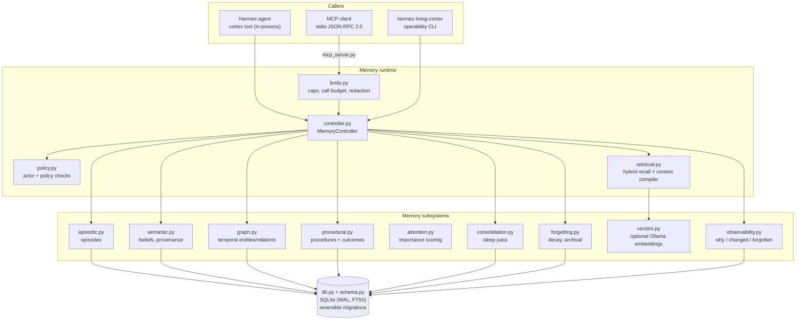

# Hungry Hippa

**Hungry Hippa is a local-first memory runtime that helps AI agents retain
experience across sessions, retrieve relevant history and share explicitly
authorized context without surrendering the underlying memory database to a model
provider.**

This repository was formerly **Living Cortex**. Hermes still loads the plugin under the
name `living-cortex` and the agent tool is still `cortex`, so existing installs keep
working; see [MIGRATION.md](docs/MIGRATION.md).

Episodic memory, a temporal knowledge graph, semantic beliefs with provenance,
contradiction and supersession handling, a context compiler, consolidation, reversible
forgetting, procedural learning, quarantine for untrusted writes, and a local MCP
server — on top of plain SQLite, in the Python standard library.

Not a vector database, not chat-history search, not a bigger `MEMORY.md`.

```
PERCEIVE → ATTEND → RECALL → COMPILE CONTEXT → REASON → ACT → OBSERVE
    ↑                                                            ↓
    └──────── CHANGE ← CONSOLIDATE ← FORGET ← LEARN ← REMEMBER ──┘
```

## What it does, and what is tested

| Capability | Implementation | Test |
|---|---|---|
| Episodic memory | Structured episodes (context, actions, tools, decisions, outcome, importance) | `test_acceptance.py` T1 |
| Immutable evidence | sha256-hashed `evidence` rows, insert-only | T7 |
| Temporal graph | Entities + relationships with `valid_from`/`valid_until`; supersession keeps history | T3, T4 |
| Semantic beliefs | Facts/beliefs/hypotheses with `source_class` provenance and confidence | T5, T7 |
| Contradictions | All claims preserved and cross-linked; explicit user correction wins | T5 |
| Hybrid retrieval | FTS5 + graph traversal, ranked by salience × recency × relevance × confidence, decomposable via `explain=True` | T2, T10, `test_memory_architecture.py` |
| Context compiler | `{items, rendering, token_estimate, excluded}` inside an explicit character budget; dedupe; active beats superseded | `test_memory_architecture.py` |
| Quarantine + actor policy | Untrusted writes stored quarantined; excluded from recall, belief listing and consolidation input | `test_memory_architecture.py`, `test_security.py` |
| Consolidation | Deterministic "sleep" pass: dedupe, relationship extraction, contradiction analysis, procedural candidates | T9, T6 |
| Forgetting | Decay, compression, reversible archival; purge is owner-only and confirm-gated over MCP | T8, `test_security.py` |
| Procedural memory | Experience → procedural candidate → validated procedure → skill promotion (needs explicit user approval) | T6, `test_memory_architecture.py` |
| Local MCP server | Six `hippa_*` tools over stdio JSON-RPC 2.0, no network listener | `test_mcp_schema.py` |
| Request limits | Argument, result and frame caps; per-process call budget; audit-log redaction | `test_security.py` |

Explicitly **not** implemented, and not claimed: model training, model-weight updates,
consciousness, self-learning, "unhackable", enterprise-ready, multi-tenant isolation,
encryption at rest (use your OS), tamper-evident audit chain. See
[docs/SECURITY.md](docs/SECURITY.md) and [docs/THREAT_MODEL.md](docs/THREAT_MODEL.md).

## Quick start

Requires Python 3 and SQLite (both standard). No third-party packages, no network calls
required.

```bash
# 1. Put the plugin where Hermes looks for user plugins
cp -r living-cortex "$HERMES_HOME/plugins/"

# 2. Make it the active memory provider (name stays living-cortex for compatibility)
hermes config set memory.provider living-cortex

# 3. Verify
hermes memory status            # Provider: living-cortex — installed, available
hermes living-cortex status     # database health + counts (no row contents)
```

The provider activates in new sessions. Hermes' built-in `MEMORY.md`/`USER.md` memory
stays active alongside it (mirrored into the store with provenance).

Check it works without touching your data:

```bash
python scripts/check_all.py                # every suite + demo check + eval drift check
```

Or run them individually:

```bash
python tests/test_acceptance.py            # 10/10 spec acceptance tests, temp DB
python demo/demo.py --check                # 8-step demo, throwaway DB, verified transcript
python eval/harness.py                     # memory challenge, writes eval/results.json
```

## Architecture



Every module above exists in this repository (see `Layout`). The diagram is a map of
the code, not a plan.

## Install, in detail

Hungry Hippa is a Hermes plugin directory, so installation is a copy plus one config
key. There is no package to build, no service to start and no daemon.

```bash
git clone <this repository> living-cortex
cp -r living-cortex "$HERMES_HOME/plugins/"
hermes config set memory.provider living-cortex
```

## Configuration

Defaults live in `config.py`. Override them in Hermes config under the plugin section,
or with environment variables for the database path.

```yaml
# $HERMES_HOME/config.yaml
plugins:
  living-cortex:
    db_path: ""                    # empty -> $HERMES_HOME/hungry_hippa.db
    retrieval:
      max_context_chars: 1500      # context compiler budget
      max_items: 6
      recency_half_life_days: 45
      vectors_enabled: true        # set false to stay fully offline
      embedding_model: nomic-embed-text
      ollama_url: http://127.0.0.1:11434
    consolidation:
      on_session_end: true
      cron_schedule: "0 4 * * *"
    provider:
      auto_episode_on_session_end: true
      prefetch_enabled: true
      mirror_builtin_memory_writes: true
    privacy:
      vision_memory_enabled: false
      audio_memory_enabled: false
      location_memory_enabled: false
      face_identity_memory_enabled: false
```

Environment:

| Variable | Meaning |
|---|---|
| `HUNGRY_HIPPA_DB` | Database path (wins over config `db_path`) |
| `LIVING_CORTEX_DB` | Deprecated alias; still honoured, emits `DeprecationWarning` |
| `HUNGRY_HIPPA_MAX_MCP_CALLS` | Per-process MCP call budget (default 1000) |
| `HUNGRY_HIPPA_DEMO_DB` | Database path used by `demo/demo.py` |

New installs use `hungry_hippa.db`. If an existing `$HERMES_HOME/living_cortex.db` is
present it is discovered and used instead, so memories are not stranded by the rename.

## MCP server

`mcp_server.py` exposes the same runtime over **local stdio** for other MCP-capable
clients. No network listener, no socket, no HTTP.

```bash
python mcp_server.py                  # serve on stdio
python mcp_server.py --print-schemas  # inspect the tool schemas
python -m mcp_server                  # same, from the plugin directory
```

| Tool | Purpose |
|---|---|
| `hippa_remember` | Store an episode or a belief |
| `hippa_recall` | Hybrid recall under actor policy; `explain: true` for score parts |
| `hippa_build_context` | Compiled context package inside a character budget |
| `hippa_record_outcome` | Record whether a stored procedure worked |
| `hippa_forget` | Archival (default, reversible) or confirm-gated purge (owner only) |
| `hippa_status` | Counts and health. Counts only — never row contents |

Example client config (illustrative, **not verified against a live client** — see
[docs/MCP.md](docs/MCP.md)):

```toml
# ~/.grok/config.toml  (Grok CLI; schema taken from Grok's own user guide)
[mcp_servers.hungry-hippa]
command = "python"
args = ["/path/to/living-cortex/mcp_server.py"]
enabled = true
```

Caller identity defaults to `mcp-untrusted`: untrusted writers get quarantine,
untrusted readers get only their own unclassified, non-quarantined rows, and purge is
denied. This is an actor/policy check, not capability-based security.

## Troubleshooting

| Symptom | Cause and fix |
|---|---|
| `hermes memory status` shows the provider as unavailable | The database directory is not writable, or the plugin was copied somewhere Hermes does not load plugins from. Check `$HERMES_HOME/plugins/living-cortex` exists and `hermes living-cortex status` runs. |
| A `DeprecationWarning` about `LIVING_CORTEX_DB` | You are using the old environment key. Switch to `HUNGRY_HIPPA_DB`; the old key still works. |
| Recall returns nothing for something you know is stored | Common causes: the query has no matching tokens (FTS is keyword-based; enable vectors for paraphrases), a `project` filter excludes it, the item is **quarantined** (untrusted write — review with `hermes living-cortex recall "<topic>" --quarantined`), or the row is `archived`/`superseded` and correctly no longer current. |
| Everything is missing for a second client | That client is using the default `mcp-untrusted` actor. Untrusted actors only read their own unclassified, non-quarantined rows. Pass `actor_id: "primary"` only for a client you control, and read the limitation in `docs/SECURITY.md`. |
| Recall quality dropped | Vector search may be off (Ollama not running, or `vectors_enabled: false`). Recall then degrades to keyword + graph, which is the documented failure mode. |
| An MCP client connects but no tools appear | Tool names are namespaced by the client (e.g. `hungry-hippa__hippa_recall`). Check `grok mcp doctor <name>` or your client's equivalent, and read the server's stderr log — this server writes nothing to stdout except protocol frames. |
| `purge` is refused | Purge needs `confirmation: true` **and** an owner actor; it is denied by default over MCP. Use `mode: "archival"` for reversible forgetting. |
| Retrieval is slow | Retrieval latency grows slowly with store size (≈3–4 ms median at 2 000 episodes in `eval/REPORT.md`). If it is far worse, check for a huge `max_items` or an Ollama timeout on every call. |
| The FTS index looks inconsistent | The schema layer self-heals: if the FTS table is empty while source rows exist, it is rebuilt from source on open. If that fails, the affected database logs a warning and recall degrades to graph-only. |

More detail: [docs/SECURITY.md](docs/SECURITY.md), [docs/MIGRATION.md](docs/MIGRATION.md),
[docs/MCP.md](docs/MCP.md), [docs/TECHNICAL_REPORT.md](docs/TECHNICAL_REPORT.md),
[docs/COMPARISON.md](docs/COMPARISON.md).

## Evidence, not adjectives

| Claim | Where the evidence is |
|---|---|
| The acceptance suite passes | `python tests/test_acceptance.py` → 10/10 |
| Memory-layer behaviour (quarantine, explain, budget) | `python tests/test_memory_architecture.py` → 8/8 |
| MCP schemas, policy and stdio round trip | `python tests/test_mcp_schema.py` → 11/11 |
| Limits, redaction, injection resistance, no-export | `python tests/test_security.py` → 14/14 |
| Identity binding, existence oracle, file permissions | `tests/test_trust_boundary.py` 6/6, `tests/test_existence_oracle.py` 5/5, `tests/test_file_permissions.py` 6/6 |
| Provenance, injection framing, supersession, confused deputy, resources | `tests/test_provenance.py` 6/6, `tests/test_injection_framing.py` 7/7, `tests/test_supersession.py` 7/7, `tests/test_confused_deputy.py` 6/6, `tests/test_resource_limits.py` 8/8 |
| Migration keeps existing memories | `python tests/test_migration.py` → 7/7 |
| Memory challenge results (with vs without) | `python eval/harness.py` → `eval/REPORT.md`, `eval/results.json` |
| The demo runs and matches its expected output | `python demo/demo.py --check` |

The evaluation harness is deterministic and offline: it compares a
session-transcript-only agent against the runtime using the same reader, and marks
metrics that need an LLM judge as unsupported rather than estimating them.

## Layout

```
living-cortex/
├── __init__.py          # LivingCortexProvider (Hermes MemoryProvider)
├── controller.py        # MemoryController — the central abstraction
├── policy.py            # actor + policy checks (not capability security)
├── limits.py            # request/result caps, call budget, log redaction
├── episodic.py          # episodes
├── graph.py             # temporal knowledge graph
├── semantic.py          # beliefs, provenance, contradictions
├── procedural.py        # procedural learning + validation
├── retrieval.py         # hybrid retrieval + context compiler
├── vectors.py           # optional local embeddings (Ollama, fail-safe)
├── consolidation.py     # "sleep" pass
├── forgetting.py        # decay / compression / archival
├── attention.py         # importance scoring
├── vision.py            # visual episodic memory (privacy-gated)
├── neural.py            # neural-memory interface (stub, no model weights)
├── observability.py     # why / changed / forgotten / export
├── tools.py             # `cortex` tool schema + dispatch
├── cli.py               # `hermes living-cortex` CLI
├── mcp_server.py        # local stdio MCP server
├── schema.py            # SQLite schema + reversible migrations
├── db.py                # connections, mutation log, FTS reindex
├── config.py            # config resolution + privacy defaults
├── tests/               # acceptance, migration, memory, MCP, security suites
├── eval/                # memory challenge harness, results, report
├── demo/                # scripted 8-step demo + expected output
├── scripts/             # seed example, build recording
└── docs/                # baseline, migration, MCP, security, threat model, report
```

## Contributing

See [CONTRIBUTING.md](CONTRIBUTING.md). Short version: run the five test files plus the
demo check before sending a change, keep the stdlib-only rule, and do not add a claim to
a document that no test or measurement supports.

## Changelog

See [CHANGELOG.md](CHANGELOG.md).

## License

MIT — see [LICENSE](LICENSE). Dependency and content notes:
[docs/LICENSE_NOTES.md](docs/LICENSE_NOTES.md).

## Security

Report issues via GitHub (no security email address exists or should be assumed):
[SECURITY.md](SECURITY.md).
